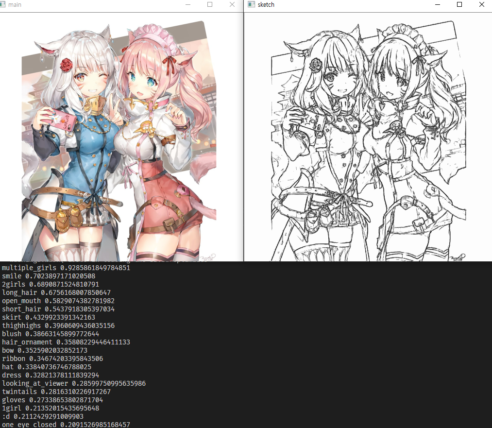

# sketch-i2v
## Extract Tags from Sketch Illustrations with modified [illustration2vec](https://github.com/rezoo/illustration2vec) SE-ResNeXt Network

----

Train/Tag set: Danbooru2017

## Sketch Example


**Download [model.pth](https://github.com/MerHS/sketch-i2v/releases)** and place it in root folder

```test.py --sketch sketch.png```

----

## Color Example



**Download mod.h5 from [sketchKeras](https://github.com/lllyasviel/sketchKeras)** and place it in ```sketchify/mod.h5```

```test.py color.png```

```---blend``` : rough sketch version
